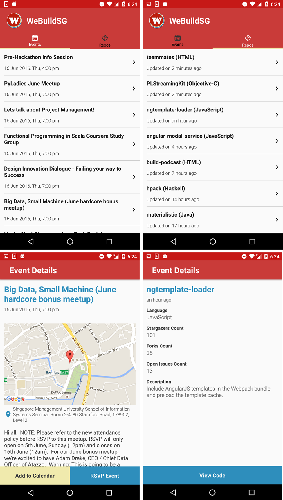
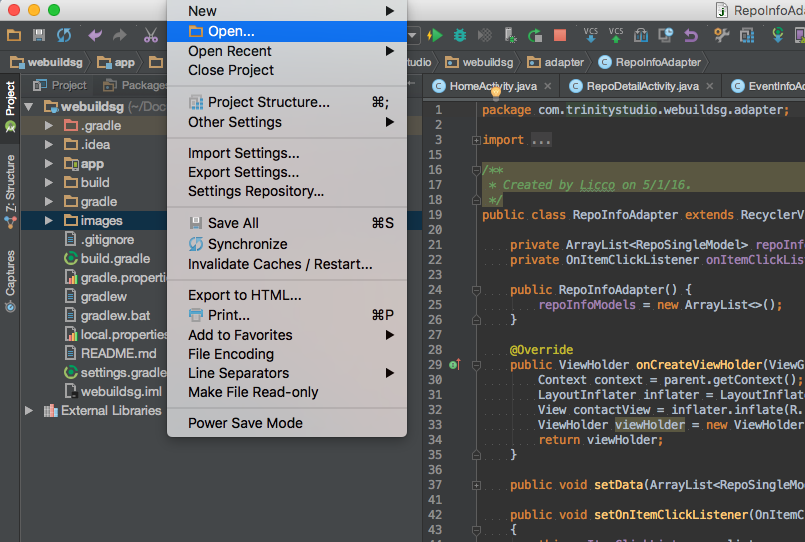
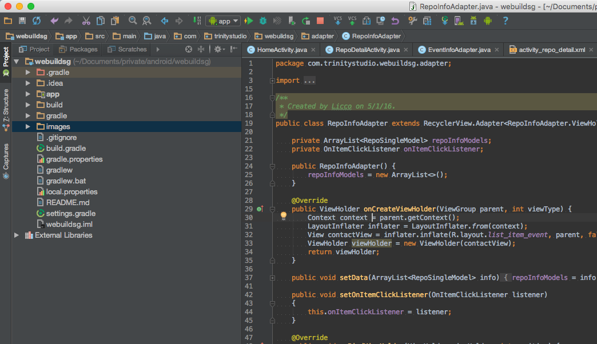

# webuildsg-android
> Android client for android devices with OS 4.0 and above to display the data from [We Build SG](https://webuild.sg/). Download from the [App Store](https://itunes.apple.com/us/app/we-build-sg/id1089421487?mt=8)!

## Quick start

*Note: You do not need to have the Google developer program to run in your device. Just connect your android device* :cool:

1. Clone with `https://github.com/liccowee/webuildsg-android.git`

2. File -> Open `webuildsg-android` project in the latest version of Android Studio

  
3. Click Instant-Run button and run it in your device.

  

## Credits

Thank you:

## License

MIT
